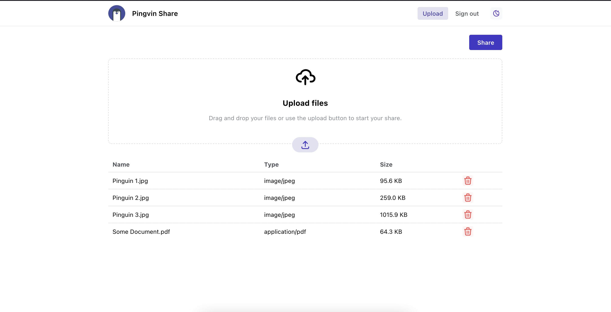

# 
  Pingvin Share

Pingvin Share is a selfhosted file sharing plattform made for the [Appwrite Hackathon](https://dev.to/devteam/announcing-the-appwrite-hackathon-on-dev-1oc0).

## Showcase

https://pingvin-share.dev.eliasschneider.com

## Setup

At the moment, the setup is a bit time-consuming. I will improve the setup in the future.

### 1. Appwrite

Pingvin Share uses Appwrite as backend. You have to install and setup Appwrite first

1.  [Install Appwrite](https://appwrite.io/docs/installation)
2.  Create an Account on your Appwrite instance
3.  Change the `_APP_STORAGE_LIMIT` variable in the `.env` file of Appwrite to your prefered max size limit per share

### 2. Frontend

First of all you have to start the Docker container.

1. Clone the `docker-compose.yml` file and the `.env.example` file from this repository
2. Rename the `.env.example` file to `.env`
3. Start the container with `docker-compose up -d`

The container is now running. Now you have to setup the Appwrite structure, but no worries I made a setup script.

To start the script run `docker-compose exec pingvin-share node scripts/setup.js`.

You're almost done, now you have to change your environment variables that they fit to your setup.

1.  Go to your Appwrite console, visit "API Keys" and copy the "Functions API Key" secret to your clipboard.
2.  Paste the key to the `APPWRITE_FUNCTION_API_KEY` variable in the `.env` file
3.  Change `NEXT_PUBLIC_APPWRITE_HOST` in the `.env` file to the host where your Appwrite instance runs
4.  Change `NEXT_PUBLIC_MAX_FILE_SIZE` in the `.env` file to the max file size limit you want

## Known issues / Limitations

Pingvin Share is currently in beta and there are issues and limitations that should be fixed in the future.

- `DownloadAll` generates the zip file on the client side. This takes alot of time. Because of that I temporarily limited this function to maximal 150 MB.
- If a user knows the share id, he can list and download the files directly from the Appwrite API even if the share is secured by a password or a visitor limit.

## Contribute

You're very welcome to contribute to Pingvin Share!
Contact me, create an issue or directly create a pull request.
